# Claude Relay Service - 架构文档

## 📋 项目概述

Claude Relay Service 是一个**多平台 AI API 中转服务**，作为客户端（Claude Code、Gemini CLI、Codex、Droid CLI 等）与 AI API 之间的中间件，提供认证、限流、监控、定价计算、成本统计等功能。

### 核心价值
- 🔐 **数据安全**: 所有请求仅经过自建服务器，直连各平台 API
- ⚡ **性能可控**: 智能调度、连接池、缓存优化
- 💰 **成本透明**: 详细的 Token 使用和费用统计
- 📊 **监控完整**: 使用情况、成本分析、性能监控
- 🌐 **多平台**: 支持 8 种不同的 AI 服务账户类型

---

## 🏗️ 系统架构概览

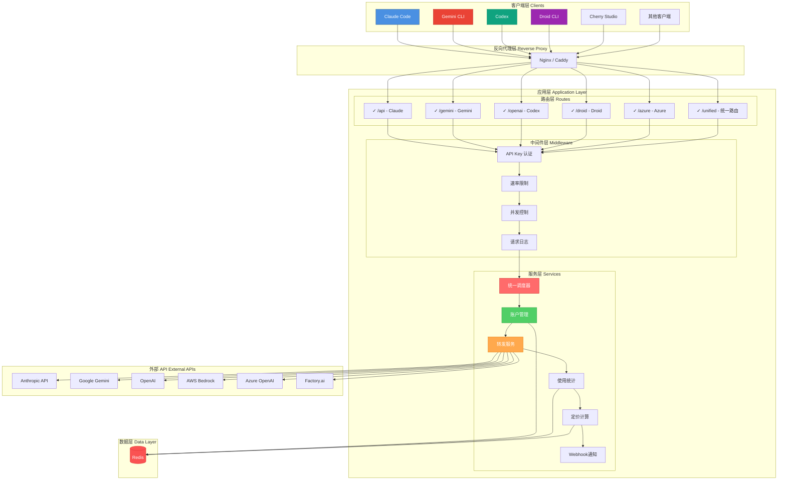

---

## 🎯 核心技术栈

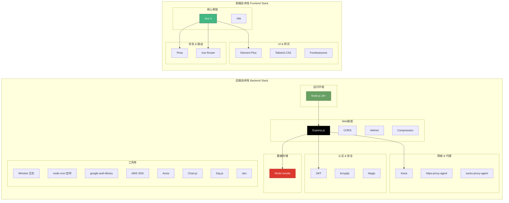

---

## 🔄 请求处理流程

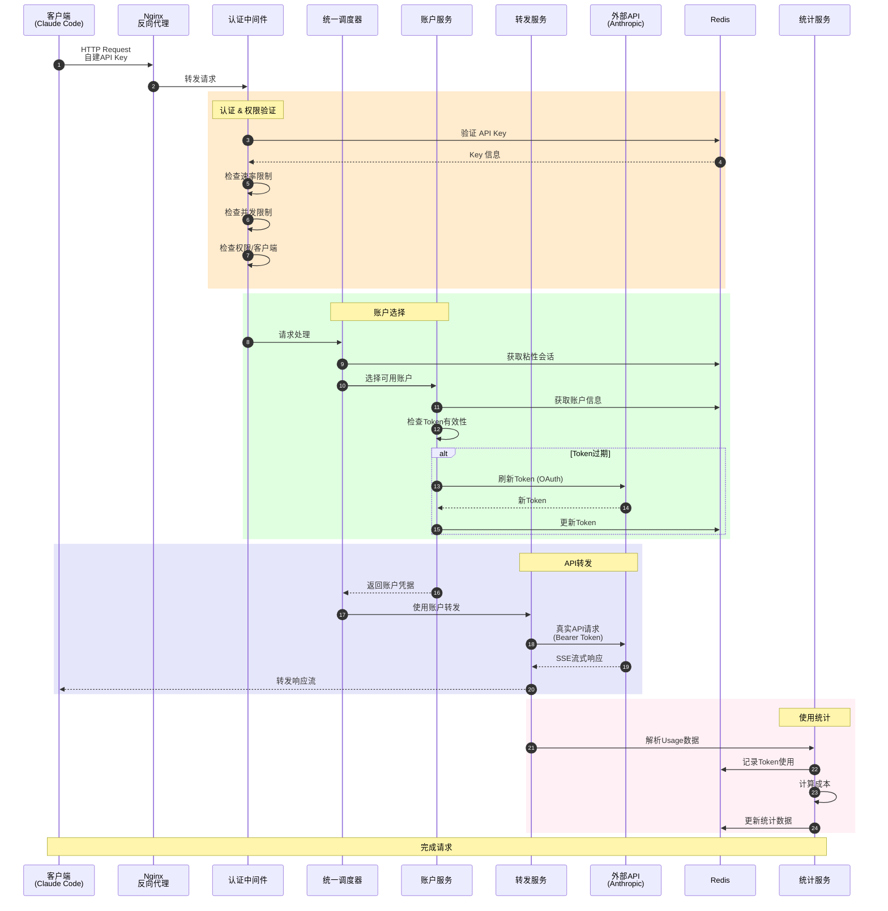

---

## 🌐 多平台账户架构

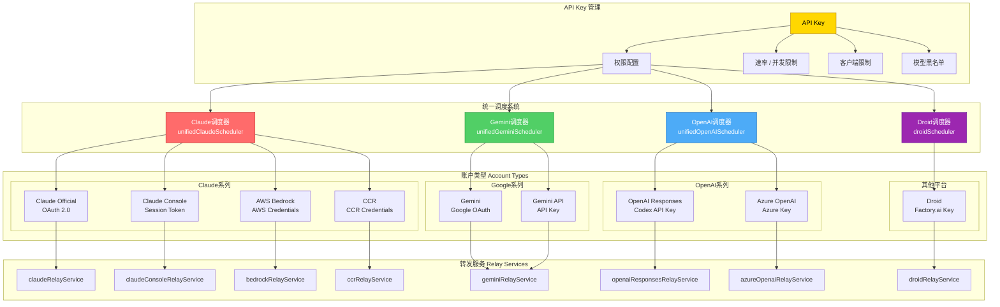

---

## 🔐 认证与安全架构

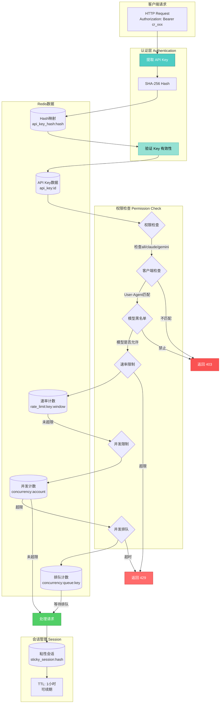

---

## 📊 数据流与统计架构

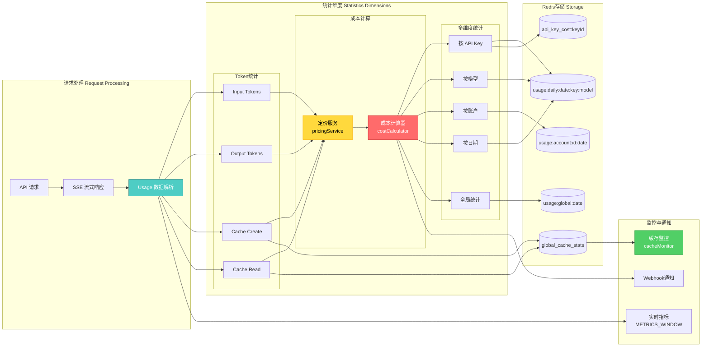

---

## 🔄 OAuth 认证流程

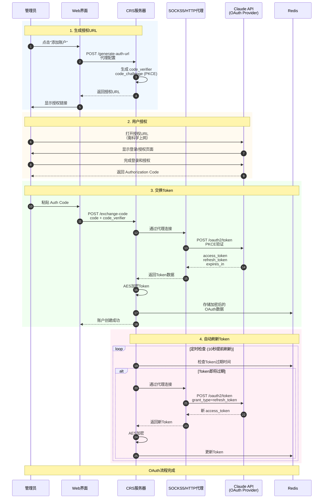

---

## 🎨 Web 管理界面架构

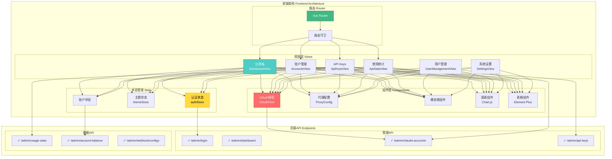

---

## 🚀 并发控制与排队机制

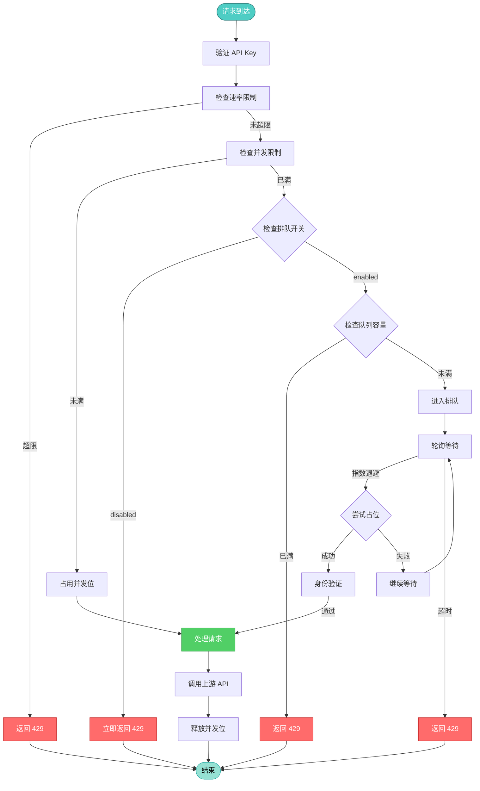

**并发排队机制说明**:

- **配置参数**:
  - `concurrentRequestQueueEnabled`: 启用/禁用排队（默认 false）
  - `concurrentRequestQueueMaxSize`: 最大排队数
  - `concurrentRequestQueueTimeoutMs`: 排队超时时间（默认 10 秒）
  - `concurrentRequestQueueHealthCheckEnabled`: 健康检查开关

- **智能特性**:
  - 指数退避防惊群（200ms ~ 2s，带 ±20% 抖动）
  - UUID token + Socket 引用双重身份验证
  - TTL 自动清理泄漏计数
  - P90 等待时间健康检查

---

## 🔧 服务启动流程

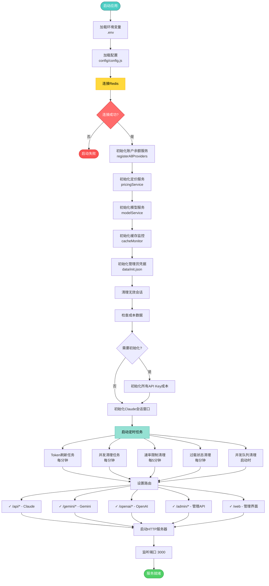

---

## 📁 目录结构

```
claude-relay-service/
├── src/                        # 源代码主目录
│   ├── app.js                  # 应用入口文件
│   ├── routes/                 # 路由层
│   │   ├── api.js              # Claude API 路由
│   │   ├── geminiRoutes.js     # Gemini 路由
│   │   ├── openaiRoutes.js     # OpenAI 路由
│   │   ├── droidRoutes.js      # Droid 路由
│   │   ├── admin/              # 管理路由
│   │   └── ...                 # 其他路由
│   ├── services/               # 服务层（核心业务逻辑）
│   │   ├── unifiedClaudeScheduler.js    # Claude 统一调度器
│   │   ├── unifiedGeminiScheduler.js    # Gemini 统一调度器
│   │   ├── unifiedOpenAIScheduler.js    # OpenAI 统一调度器
│   │   ├── claudeAccountService.js      # Claude 账户管理
│   │   ├── claudeRelayService.js        # Claude 转发服务
│   │   ├── apiKeyService.js             # API Key 服务
│   │   ├── pricingService.js            # 定价服务
│   │   ├── userService.js               # 用户服务
│   │   └── ...                          # 其他服务（30+）
│   ├── middleware/             # 中间件
│   │   ├── auth.js             # 认证中间件
│   │   └── browserFallback.js  # 浏览器回退
│   ├── models/                 # 数据模型
│   │   └── redis.js            # Redis 客户端
│   ├── utils/                  # 工具函数
│   │   ├── logger.js           # Winston 日志
│   │   ├── oauthHelper.js      # OAuth 工具
│   │   ├── proxyHelper.js      # 代理工具
│   │   ├── cacheMonitor.js     # 缓存监控
│   │   └── ...                 # 其他工具
│   └── cli/                    # CLI 工具
│       └── initCosts.js        # 成本初始化
├── web/                        # 前端代码
│   └── admin-spa/              # Vue 3 管理界面
│       ├── src/
│       │   ├── views/          # 页面视图
│       │   ├── components/     # 组件
│       │   ├── stores/         # Pinia 状态
│       │   └── router/         # 路由配置
│       └── package.json
├── config/                     # 配置文件
│   ├── config.js               # 主配置
│   └── pricingSource.js        # 定价数据源
├── scripts/                    # 脚本工具
│   ├── setup.js                # 初始化脚本
│   ├── manage.js               # 服务管理
│   └── ...                     # 其他脚本
├── cli/                        # 命令行工具
│   └── index.js                # CLI 入口
├── logs/                       # 日志目录
├── data/                       # 数据目录
│   └── init.json               # 管理员凭据
├── docs/                       # 文档目录
├── .env                        # 环境变量
├── package.json                # 项目配置
└── docker-compose.yml          # Docker 配置
```

---

## 🔑 Redis 数据结构

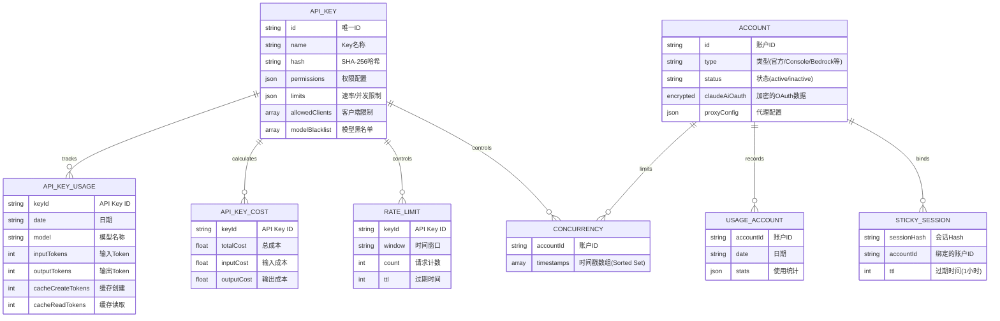

---

## 🎯 核心特性说明

### 1. 统一调度系统
- **智能账户选择**: 根据模型、会话hash、权限自动选择最优账户
- **粘性会话**: 同一会话（session_id）始终使用同一账户，支持自动续期
- **负载均衡**: 跨多个账户类型的智能调度
- **故障转移**: 账户异常时自动切换到其他可用账户

### 2. 多账户类型支持
支持 8 种账户类型：
- **claude-official**: Claude 官方 OAuth
- **claude-console**: Claude Console Session
- **bedrock**: AWS Bedrock
- **ccr**: CCR Credentials
- **droid**: Factory.ai
- **gemini**: Google Gemini OAuth
- **openai-responses**: OpenAI Responses (Codex)
- **azure-openai**: Azure OpenAI

### 3. 并发请求排队
- **工作原理**: "先占后检查"模式，轮询尝试占位
- **指数退避**: 200ms~2s，带±20%抖动防惊群
- **Socket身份验证**: UUID token + socket引用双重验证
- **智能清理**: TTL保护，自动清理泄漏计数
- **健康检查**: P90等待时间过载保护

### 4. 安全与加密
- **API Key哈希**: SHA-256存储
- **数据加密**: AES加密敏感数据（OAuth token、credentials）
- **解密缓存**: LRU缓存优化性能
- **权限控制**: 细粒度权限（all/claude/gemini/openai）
- **客户端限制**: 基于User-Agent的客户端识别

### 5. 成本与统计
- **实时统计**: 捕获真实usage数据（input/output/cache）
- **多维度**: 按Key、模型、账户、日期统计
- **成本计算**: 自动计算token成本
- **缓存监控**: 全局缓存统计和命中率
- **Webhook通知**: 事件通知系统

---

## 🚀 部署架构

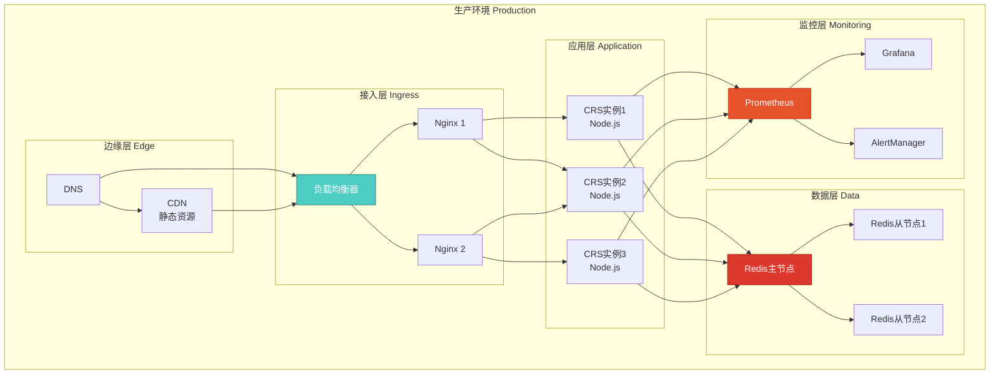

---

## 📝 总结

Claude Relay Service 是一个功能完整、架构清晰的多平台 AI API 中转服务，具备：

✅ **多平台支持**: 8种账户类型无缝集成
✅ **高性能**: 连接池、缓存、并发控制
✅ **高可用**: 智能调度、故障转移、健康检查
✅ **安全可靠**: 多层加密、权限控制、客户端限制
✅ **易于管理**: 现代化 Web 界面、CLI 工具
✅ **成本透明**: 详细的使用统计和成本计算
✅ **可扩展**: 模块化设计、统一调度系统

---

*文档生成时间: 2026-01-10*
*项目版本: v1.0.0*
